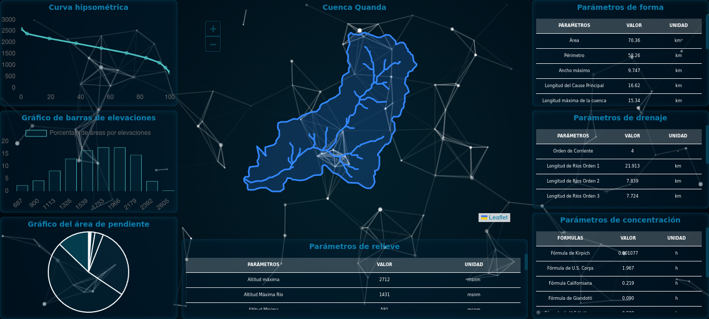

# Dashboard de Parámetros Morfológicos de la Microcuenca Quanda

Este proyecto presenta un dashboard interactivo para visualizar los parámetros morfológicos de la microcuenca Quanda. 



## Información sobre la Microcuenca Quanda

La microcuenca Quanda se encuentra en una región con un área total de 7017 ha. De esta área, 2170 ha corresponden a bosque nuboso, esencial para el mantenimiento del caudal del río. Este bosque provee el servicio hidrológico para el consumo humano en localidades de la parte media y baja de la cuenca, además de contribuir a la generación de energía en la Central Hidroeléctrica Quanda.

Aproximadamente 2170 ha de la microcuenca están cubiertas por bosque nuboso adyacente a los caseríos de Jorge Chávez, Santa Fe, Miraflores, Nuevo Huancayo, Camaná, Nueva Villa Rica y Santo Tomás. La parte alta de la cuenca alberga entre 2500 y 2600 habitantes distribuidos en 12 caseríos, con una organización local derivada de la actividad cafetalera y ganadera, así como la existencia de la Ronda Campesina. La infraestructura en la región es adecuada para facilitar el acceso a un punto central de encuentro entre los caseríos de la cuenca alta.

El bosque en la microcuenca es vital para mantener el caudal del río, que es esencial para la producción de electricidad distribuida a 40,600 conexiones en las provincias de Jaén, San Ignacio, Bagua y Utcubamba.

## Tecnologías Utilizadas

El dashboard ha sido desarrollado utilizando las siguientes tecnologías:

- **Tailwind CSS**: Para el diseño y estilos del dashboard.
- **jQuery**: Para facilitar la manipulación del DOM y manejar eventos.
- **Particles.js**: Para los efectos de partículas interactivos en el fondo.
- **Chart.js**: Para la creación de gráficos interactivos y visualizaciones de datos.
- **Leaflet**: Para la integración de mapas interactivos.
- **Partículas.js**: Para efectos adicionales de partículas personalizadas en el dashboard.

## Archivos del Proyecto

- `js/tailwind.js`: Configuración y estilos de Tailwind CSS.
- `js/jquery.js`: Biblioteca jQuery.
- `js/particles.js`: Efectos de partículas.
- `js/particulas.js`: Configuración de partículas personalizadas.
- `js/chart.js`: Biblioteca Chart.js para gráficos.
- `js/configChart.js`: Configuración específica para Chart.js.
- `js/cuenca/quanda.js`: Datos y configuraciones para la microcuenca Quanda.
- `js/cuenca/rios.js`: Datos y configuraciones para los ríos de la cuenca.
- `js/leaflet.js`: Biblioteca Leaflet para mapas.
- `js/configLeaflet.js`: Configuración específica para Leaflet.

## Instalación

1. Clona el repositorio:
    ```bash
    git clone <url-del-repositorio>
    ```
2. Navega al directorio del proyecto:
    ```bash
    cd <directorio-del-proyecto>
    ```
3. Abre el archivo `index.html` en tu navegador para ver el dashboard en acción.


